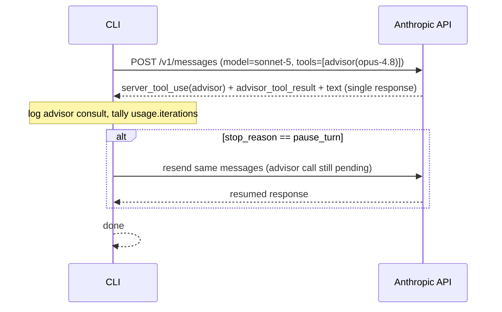
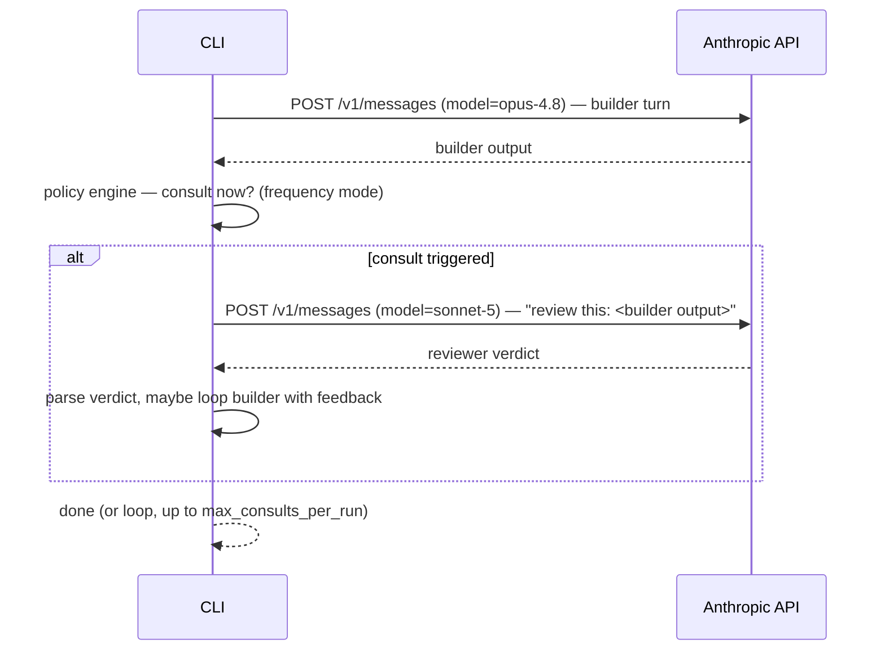

# Advisor Orchestrator — Design Doc (all proposed, nothing built yet)

Reader: whoever builds this next (you, or a fresh Claude Code session with this doc pasted in). Mode: **forward** — greenfield, no existing code to verify against.

## 0. Open questions — answer whenever, defaults used below so this isn't blocked

| # | Question | Default assumed |
|---|---|---|
| 1 | Lives where? Own repo, or subfolder of Slejvak.cz? | **Standalone repo/package** — matches "runs separately on node", keeps it out of the weather app |
| 2 | Target workload — coding only, or general? | **General/task-agnostic** — config-driven, no hardcoded coding assumptions |
| 3 | Claude Code skill wrapper too, or pure CLI? | **Pure CLI/library v1.** Skill wrapper (like ponytail) is a fast follow, not v1 |
| 4 | Default model pair? | **Sonnet 5 (builder) ⇄ Opus 4.8 (advisor)**, config swappable to any two model IDs |
| 5 | Billing | Needs its own Anthropic API key + Console billing — separate from any Claude.ai subscription (established earlier in this session) |

---

## 1. Purpose

A standalone Node CLI/library that runs a **builder model** against a task, with a **reviewer model** periodically checked in on its work — configurable direction (either model can be builder or reviewer), configurable frequency (every turn / every N turns / only-when-builder-is-unsure / before-declaring-done), and configurable token budget (including a "saver" mode aimed at *net lower* cost than running the builder alone, not just lower than running the reviewer on everything).

Two mechanisms exist to implement "one model checks another," and they are **not interchangeable** — that's the first real decision.

---

## 2. Decision: hybrid of native Advisor tool + custom orchestrator (ADR)

| | Native Advisor tool (`advisor_20260301`, beta) | Custom orchestrator (hand-rolled) |
|---|---|---|
| How it works | Builder emits a `server_tool_use` mid-generation; Anthropic runs the reviewer server-side in the same `/v1/messages` call; result returns as `advisor_tool_result` | Two independent `/v1/messages` calls: run builder → send its output to reviewer as a fresh request → parse verdict → optionally loop |
| Direction constraint | **Hard-enforced server-side.** Reviewer must be ≥ as capable as builder. Sonnet-builds→Opus-reviews works. **Opus-builds→Sonnet-reviews returns 400** — the API rejects it outright, no config gets around this | Any pairing, any direction — you control both calls |
| "Ask when unsure" | **Built in for free** — the builder model itself decides when to call, and Anthropic's docs give exact system-prompt language for tuning that ("call before substantive work… when stuck… when considering a change of approach") | Must hand-roll: builder has to signal uncertainty somehow (§9), orchestrator parses it |
| Frequency control | `max_uses` (hard cap), system-prompt nudges (soft), forced `tool_choice` (force exactly one call) | Full control — any policy you write |
| Cost mechanics | Reviewer billed at its own rate only for the consult (~1.4–1.8k tokens); doesn't touch builder's per-token rate | Same idea, but you also pay a second full request's overhead (no shared context window — you resend relevant context each call) |
| Maturity | Anthropic-maintained, beta | You maintain 100 % of it |

**Decision:** use the **native tool** for the Sonnet-builds/Opus-reviews direction (the common case — cheap builder, occasional strong review). Use a **custom orchestrator** for every other pairing, including the explicitly-requested reverse direction (Opus builds, Sonnet gives a second opinion) and peer review (same-tier models cross-checking). One config surface, two execution engines underneath, selected automatically by the direction you configure.

Reframe for the reverse direction: Sonnet reviewing Opus isn't "asking a smarter model" — Sonnet is *not* more capable. It's a **cheap, fast sanity pass** (catches obvious mistakes, contradictions, missed constraints) — different value prop than the forward direction. Worth stating explicitly in the tool's own docs/help text so nobody expects Sonnet to catch what only a stronger model would.

---

## 3. System context

```mermaid
flowchart LR
    U[Developer / CLI user] -->|advisor run --config X "<task>"| CLI[Advisor Orchestrator CLI]
    CLI -->|native path: advisor_20260301 tool| API[Anthropic Messages API]
    CLI -->|custom path: 2 plain calls| API
    CLI -->|reads| CFG[(config.yaml)]
    CLI -->|writes| LOG[(usage/cost log, local file)]
```

No server, no database, no persistent state beyond an optional local usage log. Stateless per run.

---

## 4. External dependencies

| Dependency | Protocol | Failure behavior | Owner |
|---|---|---|---|
| Anthropic Messages API | HTTPS/JSON | 429/5xx → retry w/ backoff (SDK-standard); native-path advisor errors (`overloaded`, `too_many_requests`, etc.) surface in-band per the tool's own error variant — builder continues without advice, run doesn't abort | User's own API key/billing |

---

## 5. Config schema (the "highly customizable" surface)

```yaml
# advisor.config.yaml
builder:
  model: claude-sonnet-5
  effort: medium              # low | medium | high | xhigh | max

reviewer:
  model: claude-opus-4-8
  effort: high
  max_tokens: 2048            # hard cap on reviewer output — native path only;
                               # custom path caps via reviewer's own max_tokens

direction: builder-to-reviewer  # builder-to-reviewer | reviewer-to-builder | peer
                                 # (peer = same-tier models cross-check each other —
                                 #  always custom path, no native equivalent)

frequency:
  mode: on-checkpoint         # every-turn | every-n-turns | on-checkpoint |
                               # on-low-confidence | before-finish
  every_n: 3                  # used when mode: every-n-turns
  max_consults_per_run: 5     # native path -> tool's own max_uses; custom path -> loop cap

token_budget: low             # high | medium | low | saver
  # high:   no reviewer max_tokens cap, reviewer runs at its own effort ceiling
  # medium: reviewer max_tokens: 2048 (Anthropic's own recommended default)
  # low:    reviewer max_tokens: 1024 (min allowed; ~10% truncation risk per Anthropic's own benchmark)
  # saver:  builder runs at LOWER effort than baseline (e.g. low instead of medium),
  #         reviewer only engages on explicit escalation (§9) — see §10 for why/when
  #         this can beat "no reviewer at all" on total cost, and when it can't.

escalation:
  enabled: true
  trigger: builder-self-reported-uncertainty   # only mechanism in v1
  marker: "<<needs-review>>"                   # builder emits this token when unsure;
                                                # orchestrator strips it before showing output

caching: true                 # native path: advisor-side prompt caching (breaks even
                               # ~3 consults/run per Anthropic's own docs)
```

---

## 6. Component map

| Module | Responsibility | Notes |
|---|---|---|
| `config/` | Load + validate YAML (zod or similar) | Reject invalid direction/pairing combos at load time, not at request time |
| `client/` | Raw `fetch` wrapper against `/v1/messages` | Two call shapes: `nativeAdvisorCall()` (tools array includes `advisor_20260301`), `plainCall()` (no tools — used for both sides of the custom path) |
| `policy/` | Frequency + escalation engine | Pure functions: given turn index + builder output, decide "consult now?" |
| `runner/` | Orchestration loop | Branches on `direction`: native-tool loop (mostly just relaying `pause_turn` resumption) vs custom loop (manual builder↔reviewer round-trips) |
| `usage/` | Token/cost tally | Sums `usage.iterations` (native) or per-call `usage` (custom); prints against a "no-reviewer baseline" estimate for comparison |
| `cli.ts` | Entrypoint | `advisor run --config advisor.config.yaml "<task>"`, flag overrides (`--frequency low`, `--direction reverse`, `--saver`) |

---

## 7. Sequence — native path (Sonnet builds, Opus reviews)



## 8. Sequence — custom path (Opus builds, Sonnet reviews — reverse direction)



## 9. Failure path

```mermaid
sequenceDiagram
    participant CLI
    participant API as Anthropic API
    CLI->>API: consult request (either path)
    API-->>CLI: error (overloaded / rate_limited / timeout)
    CLI-->>CLI: log error, continue WITHOUT advice (native: this is the tool's own
                  documented behavior; custom: orchestrator catches + falls through)
```

---

## 10. Escalation mechanism ("if builder isn't sure, auto-ask reviewer")

**Native path:** already built in — this is literally what the Advisor tool's own docs describe (§ "call advisor... when stuck", "when considering a change of approach"). No extra mechanism needed; just ship the suggested system-prompt language from Anthropic's docs, tuned via `frequency.mode`.

**Custom path:** builder has no native tool-call hook into a reviewer, so it must self-report. v1 mechanism: instruct the builder (system prompt) to emit a literal marker token (`<<needs-review>>`) when uncertain; orchestrator regexes for it, strips it from the shown output, and triggers a reviewer call. Cheap, crude, works. (Future: structured JSON sidecar instead of a string marker, if false-positive rate on the string approach turns out to be a problem — no evidence either way yet, don't over-build before measuring.)

---

## 11. Token-saver mode — how it can net *lower* cost than no-reviewer baseline

Mechanism (hypothesis, not proven — flag honestly): drop the **builder's** own effort/thinking one notch below what you'd normally run it at *solo* (e.g. `medium` → `low`), betting that the cheap reviewer safety-net catches the resulting quality gap often enough that you don't pay for a human-driven redo cycle. Net cost = (cheaper builder runs) + (occasional cheap reviewer consults) vs. baseline = (normal-effort builder run, some fraction of which silently ships mistakes that cost more to fix later, off-system).

This only wins if: mistakes-caught-by-reviewer × cost-of-a-redo > reviewer-consult-cost + effort-tokens-saved-by-builder. That's workload-dependent — **validate on your own tasks before trusting it**, exactly as Anthropic's own docs say about the native tool generally ("results are task-dependent, evaluate on your own workload"). Don't ship `saver` as the default.

---

## 12. Cost controls (recap, all configurable per §5)

- `max_consults_per_run` — hard cap (native: tool's `max_uses`; custom: loop counter)
- `reviewer.max_tokens` — hard cap on reviewer output (native path only; min 1024 per API)
- `caching: true` — advisor-side prompt caching, breaks even ~3 consults/run (native path only)
- Frequency mode — the single biggest cost lever; `on-low-confidence` is cheapest, `every-turn` is most expensive
- `tool_choice` forcing — not in v1 config surface, but native path supports forcing exactly one consult via `tool_choice: {type:"tool", name:"advisor"}` if a "always review once" mode is wanted later

---

## 13. Non-goals (v1)

- No Claude Code skill wrapper (fast follow, not blocking)
- No >2-model panel/council (this is pairwise, not committee)
- No persistence beyond a flat local usage-log file
- No UI — CLI only

---

## 14. Risks

- Native tool is **beta** — `advisor_20260301` type string and beta header could change; pin and watch Anthropic's changelog
- Direction constraint is enforced **server-side**, not just a doc suggestion — config validation must reject `reviewer-to-builder` + `advisor_20260301`-eligible pairs at load time with a clear error, not let it 400 at request time
- "Saver mode nets lower cost" (§11) is unvalidated — first real build should include a benchmark harness comparing saver-on vs saver-off vs no-reviewer-baseline on a fixed task set, before anyone relies on the claim

---

## 15. Suggested build order (if greenlit)

1. `config/` loader + schema validation (reject invalid direction/pairing at load time)
2. `client/` — reuse the raw-fetch pattern from the earlier one-off `advisor.ts` script (deleted this session, but the shape is proven: works, hits real API, 401s correctly on bad key)
3. Native path runner (Sonnet→Opus) — smallest working slice, mirrors Anthropic's own quick-start
4. `usage/` tally + baseline comparison print-out
5. Custom path runner (reverse/peer direction)
6. `policy/` frequency modes, starting with `on-checkpoint` + `every-n-turns` (skip `on-low-confidence` until §9's marker mechanism is proven)
7. Escalation marker mechanism (custom path)
8. Benchmark harness for §11's saver-mode claim
