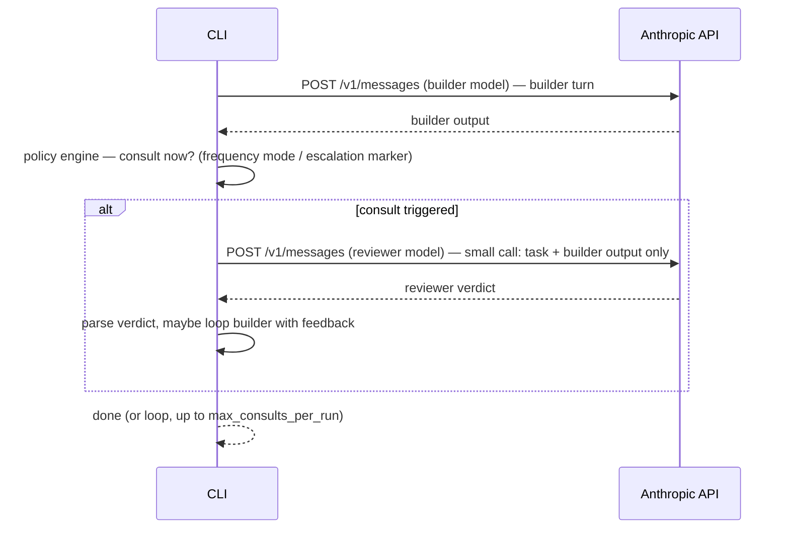
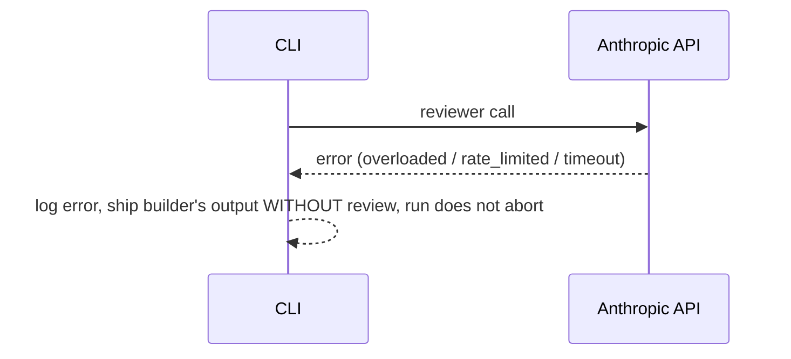

# Advisor Orchestrator — Design Doc (all proposed, nothing built yet)

> **Project renamed to `loupe` (2026-07-09).** Sections below predate the rename and keep the old name "advisor-orchestrator" for historical accuracy.

Reader: whoever builds this next (you, or a fresh Claude Code session with this doc pasted in). Mode: **forward** — greenfield, no existing code to verify against.

**Revision note:** v1 of this doc proposed a hybrid — Anthropic's beta `advisor_20260301` tool for the common direction, a hand-rolled orchestrator for everything else. Superseded: this revision drops the beta tool entirely. Single engine, our own small independent API calls, every direction. Reasons in §2.

## 0. Open questions — answer whenever, defaults used below so this isn't blocked

| # | Question | Default assumed |
|---|---|---|
| 1 | Lives where? Own repo, or subfolder of Slejvak.cz? | **Standalone repo/package** — matches "runs separately on node", keeps it out of the weather app |
| 2 | Target workload — coding only, or general? | **General/task-agnostic** — config-driven, no hardcoded coding assumptions |
| 3 | Claude Code skill wrapper too, or pure CLI? | **Pure CLI/library v1.** Skill wrapper (like ponytail) is a fast follow, not v1 |
| 4 | Default model pair? | **Sonnet 5 (builder) ⇄ Opus 4.8 (reviewer)**, config swappable to any two model IDs |
| 5 | Billing | Needs its own Anthropic API key + Console billing — separate from any Claude.ai subscription (established earlier in this session) |

---

## 1. Purpose

A standalone Node CLI/library that runs a **builder model** against a task through a **revision loop**: builder produces → reviewer critiques → builder revises → repeat. Configurable direction (either model can be builder or reviewer, including peers of equal capability), configurable frequency (review every revision / only-when-builder-is-unsure / only-before-declaring-done), and configurable token budget (including a "saver" mode aimed at *net lower* cost than running the builder alone, not just lower than running the reviewer on everything).

Every consult is **our own small, independent `/v1/messages` call** — no dependency on Anthropic's Advisor tool. One engine, one code path, any pairing.

**A "turn" = one revision cycle, not an agent step.** The builder client is a plain, toolless `messages.create()` call (§6) — it cannot take multiple autonomous actions on its own between consults the way the native Advisor tool's executor can. So frequency is measured in *revisions* (builder output → reviewer feedback → builder's next attempt), not in agent turns. This constrains §5 below: modes that presuppose a multi-step agent loop don't apply here.

**Where this sits next to what already exists:** Claude Code's own built-in `advisor()` tool already gives *me* (running inside a Claude Code session) asymmetric-priced executor+advisor consults for free, no setup. This project fills a different niche: standalone and scriptable outside any Claude Code session, with arbitrary model pairings/directions rather than one fixed asymmetric pair. If the workload already runs inside Claude Code, reach for `advisor()` first — build this only for the standalone/scriptable case.

---

## 2. Decision: fully custom orchestrator, no native Advisor tool (ADR)

Considered and rejected: Anthropic's beta `advisor_20260301` tool (the thing this project takes its name/inspiration from). Reasons to *not* build on it:

| Concern | Native Advisor tool | This project's approach |
|---|---|---|
| Direction | **Hard-enforced server-side**: reviewer must be ≥ as capable as builder. Opus-builds→Sonnet-reviews returns 400, no config gets around it | Any pairing, any direction — it's just two separate calls we make ourselves |
| Maturity | Anthropic-maintained, but **beta** — type string / beta header can change or retire under us | We own 100% of it, no upstream beta risk |
| Context sent per consult | **Whole transcript, every time**, automatically — cost grows with conversation length regardless of what the reviewer actually needs to see | **We choose what to send.** Default: just the task + the builder's latest output — small, cheap, bounded regardless of how long the run has gone. This is the concrete "separate small calls" requirement. |
| Trigger mechanism | Built into the builder model itself (it decides mid-generation) — convenient, but only works in the direction the tool allows | Our own policy engine decides (§9/§10) — slightly more to build, but works identically for every direction |
| Coupling | Tied to one Anthropic beta feature | Just the plain Messages API — works with any two model IDs Anthropic ships, present or future, no feature-flag dependency |

**Decision:** single custom orchestrator. Builder and reviewer are each just a normal `messages.create()` call; a consult is: take the builder's current output, send it to the reviewer as a fresh small request ("here's the task, here's what was produced, review it"), get a verdict back, decide what to do with it. Repeat per the frequency policy.

**Traded away, deliberately:** the native tool's automatic mid-generation triggering (the builder model itself electing to consult, inline, without us polling for it). We replace that with an explicit escalation marker (§10) — cruder, but works uniformly in every direction instead of only one.

---

## 3. System context

```mermaid
flowchart LR
    U[Developer / CLI user] -->|advisor run --config X "<task>"| CLI[Advisor Orchestrator CLI]
    CLI -->|small call: builder turn| API[Anthropic Messages API]
    CLI -->|small call: reviewer turn, task+output only| API
    CLI -->|reads| CFG[(config.yaml)]
    CLI -->|writes| LOG[(usage/cost log, local file)]
```

No server, no database, no persistent state beyond an optional local usage log. Stateless per run. No beta headers, no tool definitions beyond our own plain calls.

---

## 4. External dependencies

| Dependency | Protocol | Failure behavior | Owner |
|---|---|---|---|
| Anthropic Messages API (first-party, or Claude Platform on AWS, or Google Vertex AI, or Amazon Bedrock) | HTTPS/JSON | 429/5xx → retry w/ backoff (standard); a failed reviewer call is caught, logged, and the builder's output ships **without** review rather than aborting the run | User's own API key/billing, or GCP/AWS project credentials depending on provider |

**Why this matters for this project specifically:** the whole reason to build this instead of just using Claude Code's built-in `advisor()` tool (see README) is running *outside* a Claude Code session — including against a provider Claude Code itself doesn't route through. `client/` (§6) should stay a thin wrapper over whichever provider client the deployment needs (`AnthropicVertex` for Vertex, `AnthropicBedrock`/Mantle for Bedrock, plain `Anthropic()` for first-party) — same request/response shape across all of them, so `runner/` and `policy/` don't need to know which provider is underneath. Near-term target: Google Vertex AI.

---

## 5. Config schema (the "highly customizable" surface)

```yaml
# advisor.config.yaml
builder:
  model: claude-sonnet-5
  effort: medium              # low | medium | high | xhigh | max

reviewer:
  model: claude-opus-4-8
  effort: high
  max_tokens: 2048            # hard cap on reviewer's own output for each consult call

direction: builder-to-reviewer  # builder-to-reviewer | reviewer-to-builder | peer
                                 # all three are the SAME mechanism now (two plain calls) —
                                 # this field only decides which model plays which role

frequency:
  mode: every-revision        # every-revision | on-low-confidence | before-finish
                               # (no every-n-turns / on-checkpoint — there's no multi-step
                               #  agent loop to count turns in; see §1's "what's a turn")
  max_consults_per_run: 5     # hard loop cap, always enforced client-side

token_budget: low             # high | medium | low | saver
  # high:   no reviewer max_tokens cap beyond the model's own ceiling
  # medium: reviewer max_tokens: 2048
  # low:    reviewer max_tokens: 1024
  # saver:  builder runs at LOWER effort than baseline (e.g. low instead of medium),
  #         reviewer only engages on explicit escalation (§10) — see §11 for why/when
  #         this can beat "no reviewer at all" on total cost, and when it can't.

consult_context: latest-revision  # latest-revision | full-history
  # latest-revision (default): reviewer sees only the task + builder's most recent output —
  #   keeps every consult small and its cost roughly constant regardless of run length
  # full-history: reviewer sees every prior revision — costs more per consult as the
  #   run grows, but useful when a mistake several revisions back needs full context to catch

escalation:
  enabled: true
  trigger: builder-self-reported-uncertainty   # only mechanism in v1
  marker: "<<needs-review>>"                   # builder emits this token when unsure;
                                                # orchestrator strips it before showing output

caching: true                 # standard prompt-caching (cache_control) on the reviewer's
                               # static system/instruction text across consults in one run —
                               # ordinary Anthropic prompt caching, not tool-specific
```

---

## 6. Component map

| Module | Responsibility | Notes |
|---|---|---|
| `config/` | Load + validate YAML (zod or similar) | Any model-ID pair valid for any direction — no server-side constraint to pre-check anymore |
| `client/` | Raw `fetch` wrapper against `/v1/messages` | One call shape: `plainCall(model, messages, opts)`. Used identically for builder turns and reviewer turns |
| `policy/` | Frequency + escalation engine | Pure functions: given turn index + builder output, decide "consult now?" and "how much context to send?" (`consult_context`) |
| `runner/` | Orchestration loop | One loop, no direction branching: builder call → policy check → optional reviewer call → parse verdict → maybe feed back to builder → repeat up to `max_consults_per_run` |
| `usage/` | Token/cost tally | Sums per-call `usage` across builder + reviewer calls; prints against a "no-reviewer baseline" estimate for comparison |
| `cli.ts` | Entrypoint | `advisor run --config advisor.config.yaml "<task>"`, flag overrides (`--frequency low`, `--direction reverse`, `--saver`) |

---

## 7. Sequence — one consult cycle (works for any direction/pairing)



## 8. Failure path



---

## 9. Escalation mechanism ("if builder isn't sure, auto-ask reviewer")

No native hook to lean on now — this is the **only** mechanism, so it carries more weight than it did in the hybrid design. v1: instruct the builder (system prompt) to emit a literal marker token (`<<needs-review>>`) when uncertain; the policy engine regexes for it, strips it from the shown output, and triggers a reviewer call outside the normal frequency schedule. Cheap, crude, works.

Known weakness vs. the native tool's in-band trigger: our builder only gets to "decide" at the end of a turn (when we can see its output), not genuinely mid-generation. Good enough for a CLI loop; not equivalent to true mid-stream steering. Future: a structured JSON sidecar instead of a string marker, if the string approach's false-positive rate turns out to matter — no evidence either way yet, don't over-build before measuring.

---

## 10. Token-saver mode — how it can net *lower* cost than no-reviewer baseline

Mechanism (hypothesis, not proven — flag honestly): drop the **builder's** own effort/thinking one notch below what you'd normally run it at *solo* (e.g. `medium` → `low`), betting that the cheap reviewer safety-net catches the resulting quality gap often enough that you don't pay for a human-driven redo cycle. Net cost = (cheaper builder runs) + (occasional small reviewer consults) vs. baseline = (normal-effort builder run, some fraction of which silently ships mistakes that cost more to fix later, off-system).

This only wins if: mistakes-caught-by-reviewer × cost-of-a-redo > reviewer-consult-cost + effort-tokens-saved-by-builder. That's workload-dependent — **validate on your own tasks before trusting it**. Don't ship `saver` as the default. `consult_context: latest-revision` (§5) is what keeps each safety-net check cheap enough for the math to have a chance of working at all.

---

## 11. Cost controls (recap, all configurable per §5)

- `max_consults_per_run` — hard loop cap, always client-side
- `reviewer.max_tokens` — hard cap on reviewer output per consult
- `consult_context: latest-revision` — the single biggest structural cost win of going fully custom: every consult call stays small regardless of run length, instead of resending the whole transcript like the native tool would
- `caching: true` — ordinary prompt-caching on the reviewer's static instructions across consults in one run
- Frequency mode — the single biggest *policy* cost lever; `on-low-confidence` is cheapest, `every-revision` is most expensive

---

## 12. Non-goals (v1)

- No Claude Code skill wrapper (fast follow, not blocking)
- No >2-model panel/council (this is pairwise, not committee)
- No persistence beyond a flat local usage-log file
- No UI — CLI only

---

## 13. Risks

- Escalation (§9) is weaker than the native tool's in-band trigger — builder can only "ask" at the end of a turn, not truly mid-generation. Acceptable for v1, worth flagging so nobody expects native-tool-grade responsiveness.
- `consult_context: latest-revision` trades completeness for cost — a mistake made several turns ago, invisible in "just the latest output," won't get caught until/unless `full-history` is used. Document this trade-off in the CLI help text, not just here.
- "Saver mode nets lower cost" (§10) is unvalidated — first real build should include a benchmark harness comparing saver-on vs saver-off vs no-reviewer-baseline on a fixed task set, before anyone relies on the claim.

---

## 14. Suggested build order (if greenlit)

1. `config/` loader + schema validation
2. `client/` — reuse the raw-fetch pattern from the earlier one-off `advisor.ts` script (deleted from the Slejvak.cz repo this session, but the shape is proven: works, hits real API, 401s correctly on bad key)
3. `runner/` — single consult-cycle loop (§7), builder-to-reviewer direction first as the smallest working slice
4. `usage/` tally + baseline comparison print-out
5. `policy/` frequency modes, starting with `every-revision` + `before-finish` (skip `on-low-confidence` until §9's marker mechanism is proven)
6. Escalation marker mechanism (§9)
7. `reviewer-to-builder` / `peer` directions — same runner, just swap config, should need near-zero new code if §7 was built direction-agnostic from the start
8. Benchmark harness for §10's saver-mode claim

---

## 15. Implementation pivot — no metered API, two free engines (superseded §2/§4/§11 client details)

Between design and build, the requirement changed: **no Anthropic Console API key at all**, not even for the reviewer. §2's "custom orchestrator" decision stands unchanged; only which engine each call goes through changed.

**Two engine options, either role, config-only choice — no direction constraint, since neither is Anthropic's beta tool:**

| Engine | How | Cost |
|---|---|---|
| `local` | HTTP to a running Ollama instance (`POST /api/chat`) | $0, your own compute |
| `claude-code` | Spawn headless `claude -p "<prompt>" --model <alias> --output-format json`, parse `.result` + `.usage`/`.total_cost_usd` | Subscription-covered, no separate charge |

**Benchmark design — three arms, not two** (added after `advisor()` review flagged a real confound): `baseline` (1-pass, no reviewer) vs `advised` (N-pass + reviewer) can't isolate whether the *reviewer* helped or whether *any* N-pass revision would've helped. `self-review` (reviewer config == builder config) closes that gap for near-zero extra code — the runner already treats reviewer/builder as independent configs, so pointing both at the same engine+model needed no special-casing. `advised` only means something if it beats `self-review`.

**Gotchas found only by actually running it (all fixed in code, kept here so nobody rediscovers them the hard way):**
- `--bare` looked like the right flag to isolate each consult call from ambient CLAUDE.md/memory/hooks context — it isn't. Verified live: `--bare` forces `ANTHROPIC_API_KEY`/`apiKeyHelper`-only auth and never reads OAuth/keychain, which breaks subscription login entirely. Not used. Trade-off accepted instead: every `claude-code` call carries ambient context (observed 10k–50k+ cache-read tokens on trivial prompts) — real usage against subscription rate limits, not a real dollar cost.
- Windows: `execFile('claude', …)` → `ENOENT` (bare name doesn't resolve `.cmd` shims). `execFile('claude.cmd', …)` → `EINVAL` (`.cmd` isn't directly spawnable without `shell:true`). `shell:true` → arguments get concatenated, not escaped (Node's own deprecation warning) — multi-word prompts silently lost most of their content to cmd.exe word-splitting. Fix: prefer `CLAUDE_CODE_EXECPATH` (points at the real `.exe`, set automatically inside a Claude Code session) — no shell needed, Node's normal argv escaping just works.
- Headless mode waits ~3s for stdin before proceeding if not explicitly closed — set `stdio: ['ignore', 'pipe', 'pipe']` to skip the wait on every call.

**Provider-agnostic client-swap idea from §4 (Vertex/Bedrock) is moot for now** — there's no paid-API code path left to swap a provider under. Revisit if a metered-API engine option gets added back later.

---

## 16. First real benchmark, the cost problem it found, and the fix plan (2026-07-07)

**What shipped this session, in order:**
1. `--tools ""` added to the `claude-code` engine (§15's client) — without it, headless calls ran as full agentic sessions (one builder call wrote a stray file to disk unprompted; a reviewer call stalled on an unanswerable permission prompt). This was invalidating every result — fixed and verified live before any benchmark numbers below were collected.
2. Bench-loop error handling — a failed/rate-limited call used to crash the entire `bench` run (hit a real subscription 429 mid-run, killed everything). Fixed to match this doc's own §8 intent: reviewer failure ships the builder's output without review and logs a note (`runner.ts`); builder failure still throws (nothing to ship that round) but the `bench` loop (`cli.ts`) now catches per-arm, logs, and moves to the next task/mode instead of exiting.
3. A full clean 3-task × 3-arm run (sonnet builder, opus reviewer, `benchmark/tasks.json`) — first trustworthy numbers.

**Results — quality:** all three arms produced a correct answer on all 3 tasks. No arm caught an actual defect the others missed; these 3 tasks were easy enough that baseline alone already nailed them. `advised` did add small, real polish twice — a one-line rationale comment on the fizzbuzz branch order, and a softer, more specific apology-email rewrite that took 3 rounds (opus didn't rubber-stamp round 1, the only arm where real back-and-forth happened) — but nothing that changed correctness.

**Results — cost, summed across all 3 tasks:**

| Arm | Total tokens | vs. baseline |
|---|---|---|
| baseline | 1,347 | 1x |
| self-review | 2,313 | 1.7x |
| advised | 19,017 | **14x** |

**Root cause, verified live (correcting an earlier wrong guess in chat — logged here so it isn't repeated):** first guess was "opus and sonnet never share cache." Retested directly: two back-to-back headless opus calls showed the *second* one hit `cache_read_input_tokens: 9999` / `cache_creation_input_tokens: 0` — full reuse. Caching across separate `claude -p` processes works fine. What actually happened in the benchmark: opus was only called 2–5 times total in the whole run, and the *first* opus call of the run eats a one-time cold-start tax (ambient CLAUDE.md/system-prompt block, ~6,000–10,000 tokens, billed as `cache_creation` not a discounted `cache_read`). This is visible in the run's own numbers — opus's cost per call dropped from $0.2666 (fizzbuzz, opus's 1st call) to $0.0886 (riddle, opus's last call), ~3x cheaper, as the cache warmed up over the run. `--system-prompt <custom>` was tested as a possible fix (replace the default CLAUDE.md-laden prompt) — verified live it does **not** help; ambient per-call context comes in through a different injection point than the system-prompt flag controls, and total tokens were the same or worse.

**Goals for next session (not yet built):**

- **Warm the reviewer's cache once before the real loop** — fire one cheap throwaway call in the reviewer's model at `bench` startup, so the cold-start tax lands on a warm-up call instead of on task 1's real numbers. Cheapest fix, do this first.
- **Escalation instead of always-advised** — self-review every round (same model, cache stays warm, already-measured 1.7x), only invoke the different/bigger reviewer on the last round or when self-review doesn't approve. Cuts opus call *count*, compounds with the warm-up fix. This revives §9/§10's escalation idea, dropped from v1 scope — worth reconsidering now there's a measured reason to want it.
- **Observability gap:** `usage.ts` only prints raw `input_tokens`; `cache_creation_input_tokens`/`cache_read_input_tokens` are captured on the `claude-code` engine's `CallResult` (`cacheReadTokens`) but never surfaced. Fix this before trusting any future token comparison — right now the printed "tokens: X in" numbers understate what actually moved by the cache-creation amount, and hide exactly the warm-up-vs-cold-start effect described above.
- **Re-run the benchmark** once the above land — current numbers are a single run, 3 tasks, `repeat: 1`, still just a directional smoke test (§13's third risk, still unvalidated).
- **Still open from earlier sections, unchanged:** Claude Code skill wrapper (§12 non-goal, fast-follow), escalation via structured marker rather than string (§9's "future" note), `saver`-mode validation (§10, §13).

---

## 17. Cost-fix work shipped: observability, warm-up, escalated mode, config, tests

Everything §16 flagged "not yet built" as a next-session goal is now built — except the confirming re-benchmark, which still needs a live subscription/Ollama run and is the immediate next step.

**What shipped, in dependency order:**

1. **Cache-token observability (do-first per §16).** The `claude-code` engine now captures `cache_creation_input_tokens`, not just `cache_read_input_tokens` — `cache_creation` is the field that *is* the one-time cold-start tax, so the old code literally couldn't see the thing that explained the 14x. `usage.ts` now prints `cache: <read> / <creation>` for any run with `claude-code` calls. Without this, no post-fix number would be trustworthy; done first on purpose.
2. **Cache warm-up at `bench` startup.** Before any arm is timed, `cli.ts` fires one throwaway call to the reviewer model so the cold-start tax lands on the warm-up, not on task 1's real numbers. Best-effort: a failed warm-up is logged, not fatal (the run just eats the cold start as before).
3. **`escalated` mode (new, 4th arm).** `runner.ts` gains a mode that does cheap self-review every round (builder critiques itself, cache stays warm) and invokes the bigger reviewer **at most once per run** — the first time self-review isn't satisfied. This bounds the expensive reviewer's *call count* (advised calls it every round), compounding with the warm-up. Added to the `bench` arm list so it can be measured head-to-head against `advised`. Revives §9/§10's escalation idea with the measured reason §16 asked for.
   - **Interpretation note:** §16 said "invoke the bigger reviewer on the last round or when self-review doesn't approve." Implemented as a hard ≤1-escalation-per-run bound (fires on the first self-review non-approval; never again that run). That's the laziest faithful reading; if a later benchmark shows self-review needs the big reviewer more than once on hard tasks, relax the bound then — not before.
4. **JSON config loader (`src/config.ts`).** `--config <path.json>`, hand-rolled validation, **zero new deps** — chose JSON over the §5/§6 YAML+zod design to keep the repo dependency-free (consistent with §15's "no metered API, stay minimal" turn). Deliberately validates only the knobs the engines actually consume today (`builder`, `reviewer`, `mode`, `consults`); §5's `effort`/`token_budget`/`direction`/`frequency`/`consult_context`/marker/`caching` are omitted until the features behind them exist — accepting them now would be config for values nothing reads. Precedence: built-in defaults < config file < individual CLI flags.
5. **First test harness.** `node:test` run through `tsx` (`npx tsx --test src/*.test.ts`), 14 tests. `runner.run()` was refactored to take an injectable `callFn` (defaulting to the real engine dispatcher) so the loop's control flow — early-break on approval, reviewer-failure-ships-without-review, the escalated ≤1 bound and feedback-flow — is unit-testable with a fake engine, no API calls. `config.ts` validation rejections are covered too.

**Verified this session:** 14/14 unit tests pass; the full CLI module graph compiles under `tsx`; an invalid `--config` file throws its validation error *before* any engine call. **Not verified:** the live re-benchmark — §16's numbers are still the last real data.

**Immediate next step (unchanged from §16, now unblocked):** run `bench` again with the warm-up + observability + `escalated` arm and record the post-fix token table here. The specific hypothesis to check: `escalated` keeps `advised`'s catches while its cache-creation total and reviewer call count drop toward `self-review`'s.

---

## 18. Multi-provider engines (2026-07-08)

Scope grew: work across providers, not just ambient Claude Code. Full design in
[`docs/specs/2026-07-08-multi-provider-engines.md`](specs/2026-07-08-multi-provider-engines.md);
this is the session log.

**What triggered it:** a `bench` run failed every arm. Root cause (found by
surfacing the error claude wrote to stdout — see the `parseClaudeResult` fix):
this machine's `claude` routes through **Google Vertex AI**
(`CLAUDE_CODE_USE_VERTEX`), which returned `429 RESOURCE_EXHAUSTED` (quota) for
both sonnet and opus. That killed the §15 assumption that these calls are
"free/subscription-only" — they're metered here. The user's response was to
generalize the tool to any provider with per-role provider choice.

**What shipped:**
- **Engine interface + registry** (`src/engines/types.ts`, `index.ts`) — one
  `CallResult` shape for all providers; `runner`/`config`/`cli` go through the
  interface, so new engines are one registry entry. This revives §4/§15's
  provider-agnostic idea, dropped when the premise was "no paid API at all".
- **`codex` engine** (`src/engines/codex.ts`) — headless `codex exec --json`
  (read-only sandbox + `-a never` = the codex analog of claude's `--tools ""`).
  Parser is fixture-tested; **not verified against an installed codex** (none on
  this machine) — flagged in-file.
- **`local` + `claude-code`** refactored behind the interface (no behavior
  change; the 429-surfacing fix retained).
- **Detection + `providers` command** — each engine self-reports; `advisor
  providers` prints the availability table.
- **Selection** (`src/selection.ts`, pure + unit-tested) — precedence flags >
  config > interactive prompt (TTY) > auto-detected default. Cross-provider
  pairing is free via the already-independent builder/reviewer configs.
- **Direct-API (key-based) engines** — designed extension point, **not built**
  (add when a keyed workload needs them; secrets via env only).

**Verified:** 29/29 unit tests; `advisor providers` correct live (claude-code ✓
Vertex, codex ✗, local ✗); unknown-engine guard exits before any call. **Not
verified:** any live codex or cross-provider run (codex not installed; claude
still 429). Test count: 16 → 29.

---

## 19. Evaluation layer — make the benchmark answer its own question (2026-07-08)

**The core problem this fixes:** the tool measured cost (tokens) but never
**quality**, so it could not actually answer "does the reviewer help, and at what
cost?" §16's "all arms were correct" was a human eyeball on 3 trivial tasks with
no headroom — which is how a 14× cost looked like pure waste. Without a quality
measure, that verdict was unfounded in either direction.

**What shipped:**
- **Grader** (`src/grader.ts`, pure + injectable) — scores an output 0–1.
  `includes` (fraction of required strings), `regex` (match/no-match), and
  `judge` (an LLM scores 0–10 against a rubric; engine injectable, so tested
  offline). Execution-based grading (run code/tests) deliberately deferred —
  running model-generated code needs a sandbox (a security boundary, §13).
- **Report** (`src/report.ts`, pure) — `aggregate` + `formatReport` produce the
  product: a per-arm quality×cost table (mean score + range, mean in/out/total
  tokens, cache-creation) and a **verdict** — best quality, cheapest-at-top-
  quality, best quality-per-token, and each arm's Δquality-vs-baseline at N×
  cost.
- **Headroom tasks** (`benchmark/tasks.json`) — every task now has a `grader`,
  plus tasks single-pass models actually slip on (no-`e` sentence, bat-and-ball
  trap, exact-word-count) so arms can *differ* and grading is meaningful.
- **`bench` wiring** — grades each arm's final output (judge graders use the
  reviewer model; a grading failure leaves the run ungraded, never aborts),
  collects records, prints the report. `runOne` now returns its `RunResult`;
  `tallyTokens` extracted from `usage.ts` and reused.
- **`--tasks <path>`** — point `bench` at your own workload; the real value is
  "which mode is worth it for *your* tasks," not the built-in set.

**Verified:** 40/40 unit tests; the report renders correctly on fixture records
(quality×cost table + verdict). **Not verified live:** a real graded `bench` run
(engines still Vertex-429; judge grading also needs a working engine) — but the
scoring/aggregation/verdict are pure and fully unit-tested, so they're correct
independent of a live run. Test count: 29 → 40.

**Why this is the highest-leverage change:** it turns the project from "prints
outputs + tokens" into "tells you, per workload, which mode gives the best
quality per token." That's the actual product. Positioning sharpens too: not
"another advisor," but *the harness that tells you whether advising is worth it
for your tasks.*

**Next (roadmap, not built):** execution-grounded code review (reviewer runs the
tests and feeds failures back — where a second pass most clearly wins, needs
sandboxing); the §9 self-uncertainty escalation marker; parallel `bench` for
wall-clock; writing report records to a JSON file for later analysis.

---

## 20. Review-driven fixes + execution-grounded core (2026-07-09)

Three independent review agents (correctness, product-skeptic, YAGNI) checked the
work. They converged on real confounds in the §19 evaluation layer; this section
records the fixes and the execution-grounded pivot the product-skeptic pushed
(and the other two corroborated).

**Methodology fixes (the eval layer was measuring itself):**
- **Independent judge.** The `judge` grader used the reviewer model (opus), which
  also shapes the `advised`/`escalated` outputs — self-enhancement on judge
  tasks. Added `--judge-engine`/`--judge-model` and a printed caveat when the
  judge coincides with an arm's builder/reviewer. `bench` also now takes a real
  judge, not a hardcoded one.
- **Honest cost proxy.** The proxy omitted cache-read — but the CLI engines
  re-read a big ambient block on EVERY call, so cache-read is what scales with
  reviewer call-count. Excluding it made a 5-call arm look ~1× a 1-call arm. Now
  `total = input + output + cacheRead + cacheCreation`, with a cacheRead column.
  (Illustratively, `advised` now reads ~5× baseline, not ~1×.)
- **`bench` honors providers.** It was hardwired to claude sonnet/opus, so it
  ignored the entire multi-provider layer and couldn't fall back to local/codex
  on the 429'd machine. Now resolved via config/flags through `planSelection`.
- **Grader false-positives.** `reasoning-riddle` matched the "9" echoed from the
  prompt; `constraint-no-e` matched the empty string. Both tightened.
  `parseJudgeScore` now prefers `N/10` / the last integer (dodges scale-echoes).
- **Cross-provider selection bug.** `--builder-engine codex` with a config of
  `{claude-code, sonnet}` used to run codex with model "sonnet"; a flag engine
  override now drops a different engine's config model and uses the default.

**Execution-grounded core (the strategic pivot — test result as ground truth):**
- **`exec` grader.** Runs the model's code against `tests` in a subprocess
  (timeout, throwaway temp dir; security ceiling documented in `grader.ts` — not
  a syscall sandbox). Score = tests pass. No LLM-judge confound.
- **`verify` mode.** A programmatic verifier is the in-loop reviewer: failures
  feed back to the builder, no LLM reviewer, no tokens. The **same** exec grader
  is BOTH the in-loop signal AND the scorer — removing both thumbs from the
  scale, on the one task class (code/math) where a second pass reliably beats
  solo. `bench` adds a `verify` arm wherever a task has an exec grader.

**YAGNI cuts:** write-only `CallResult.engine`; `DetectResult.models` → a count;
the report's redundant "best quality per token" ranking.

**Verified:** 44/44 unit tests (the exec grader runs real `node` subprocesses;
the `verify` loop is unit-tested with an injected verifier); the report renders
the honest cost columns. **Not verified live:** a full graded `bench` (claude
still 429; codex/ollama absent) — but graders, verify loop, cost, and verdict
are pure/injectable and fully tested. Test count: 41 → 44.

**Why it matters:** with honest cost + an exec grader + `verify`, the report now
shows the execution-grounded arm winning on BOTH quality and cost — the concrete,
defensible result the tool previously couldn't produce. That answers the
product-skeptic's core objection: the value is programmatic verification, and the
tool now targets and measures exactly that.

---

## 21. Robustness, JSON export, and a typecheck gate (2026-07-09)

Hardening pass + the first real live runs on Vertex (us-east5).

**Live proof (finally ran, opus in `CLOUD_ML_REGION=us-east5`):** the whole
pipeline works end-to-end on Vertex — generation, exec grading, verify loop,
error-handling (transient ECONNRESETs shipped/skipped gracefully), reproducible
n=5 verdicts. Region matters: `eu_multi_region` is 429-quota-dead for every
model; `us-east5` serves `opus` and `claude-sonnet-4-6` (not sonnet-4-5, not
sonnet-5). Every *failure* observed live was **ambient output-style
contamination** — the spawned builder inherits the caller's Explanatory style and
appends `★ Insight` / backtick prose that breaks the exec grader — never an
actual algorithm error. Both opus and sonnet-4-6 solve the test tasks reliably,
so "does review help" is still unproven for lack of a genuinely weak builder.

**Fixes shipped:**
- **`extractCode` hardened** — strips trailing prose (backtick notes, plain
  explanatory sentences, ★/─ boxes), not just decorations. This was the dominant
  false-failure source in the live runs. Still best-effort; the root cure is not
  inheriting an explanatory style in the first place.
- **CLI flag validation** — `--mode` checked against `MODES`; `--consults`/
  `--repeat` must be non-negative integers (a bad value silently ran zero
  iterations before). `MODES` is now a single exported source — config had been
  silently missing `verify`.
- **`local` call timeout** (AbortSignal) so a hung Ollama can't stall a bench;
  **codex usage summed** across turn events (was overwritten).
- **`bench --out results.json`** — writes `{meta, stats, records}` so runs
  accumulate and can be diffed over time (one-shot → real eval harness).
- **Typecheck gate** — added `tsconfig.json` + `npm run typecheck` (tsc
  `--noEmit`) and devDeps (tsx/typescript/@types/node). tsc immediately caught
  real issues tsx had silently ignored: the `stdio` option was **invalid on
  execFile** (confirming it never suppressed the stdin wait — removed), several
  `unknown`-typed `res.json()` reads, and a control-flow-narrowing bug in a test.
  All fixed; `tsc --noEmit` is clean.

**Verified:** 49/49 unit tests pass; `tsc --noEmit` exits 0; `--out` writes valid
JSON; live Vertex runs produced real reproducible verdicts. **Remaining for a
real "review helps" result:** a genuinely weak builder (local Ollama small model)
or a task the strong models actually fail — plus the still-unbuilt §9
self-uncertainty marker and direct-API engines.

---

## 22. First real "review helps" result — weak local builder + opus reviewer (2026-07-09)

The experiment the whole project was built to run. Builder = `qwen2.5-coder:1.5b`
(local Ollama, weak, free), reviewer = `opus` (Vertex us-east5); hard task
(`abbreviate`, the truncate/drop-`.0` trap); n=3, consults=2. Total opus cost
$0.47 (local builder is free).

```
arm          runs   score          meaning
baseline      3     0.00           weak model solo: 0/3 (genuinely wrong code, e.g. 1000 -> "1000M")
self-review   3     0.00           weak model reviewing itself: 0/3 (can't catch its own error)
advised       3     0.67 [0-1.00]  opus reviewer: 2/3 fixed   ← review demonstrably helps
escalated     3     0.00           one opus hint wasn't enough: 0/3
verify        3     0.33 [0-1.00]  test-failure fed back: 1/3 fixed
```

**Verified honest, not a grader artifact:** the baseline output arrived in a
clean ```` ```javascript ```` fence, so `extractCode` got clean code — and that
code is genuinely wrong. This is a real capability failure the reviewer fixed.

**Findings:**
- **Review helps when the builder is weaker than the reviewer** — solo 0/3 →
  advised 2/3. This is the tool's core thesis, finally shown on real data.
- **Self-review can't rescue a weak model** (0/3) — a critic no better than the
  author adds cost, not quality. Confirms why `advised` (a *different*, stronger
  reviewer) is the arm that matters.
- **Bounded escalation backfired on a very weak builder** (0/3 vs advised's 2/3):
  one opus hint (escalated) wasn't enough; the builder needed opus feedback
  *every* round (advised). The cost-saver assumes the builder can run with a
  single nudge — false when it's this weak. Genuinely decision-relevant.
- **Programmatic verify recovered 1/3** — feeding the exact failing assertion
  back sometimes let even the weak model self-correct, at ~1/20th advised's cost.

**Caveat:** n=3 is directional; advised's "88× baseline cost" is inflated because
the local baseline is ~free — absolute opus cost was ~$0.15/advised run. Minor
tech debt surfaced: the grader's failure *detail* prints the stack-trace tail
instead of the thrown assertion message (the score is correct; the message is
unhelpful).
