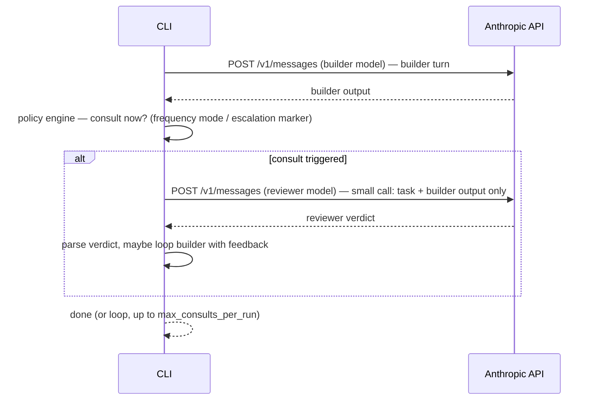
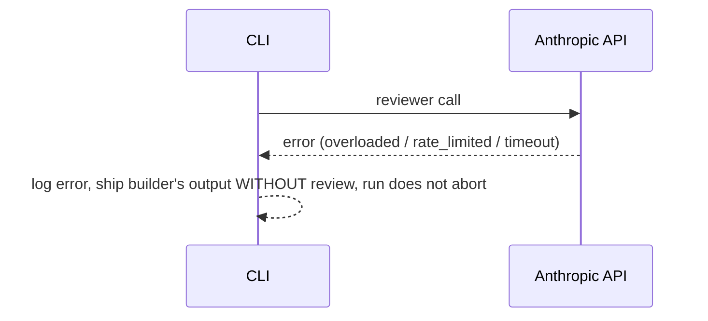

# Advisor Orchestrator — Design Doc (all proposed, nothing built yet)

Reader: whoever builds this next (you, or a fresh Claude Code session with this doc pasted in). Mode: **forward** — greenfield, no existing code to verify against.

**Revision note:** v1 of this doc proposed a hybrid — Anthropic's beta `advisor_20260301` tool for the common direction, a hand-rolled orchestrator for everything else. Superseded: this revision drops the beta tool entirely. Single engine, our own small independent API calls, every direction. Reasons in §2.

## 0. Open questions — answer whenever, defaults used below so this isn't blocked

| # | Question | Default assumed |
|---|---|---|
| 1 | Lives where? Own repo, or subfolder of Slejvak.cz? | **Standalone repo/package** — matches "runs separately on node", keeps it out of the weather app |
| 2 | Target workload — coding only, or general? | **General/task-agnostic** — config-driven, no hardcoded coding assumptions |
| 3 | Claude Code skill wrapper too, or pure CLI? | **Pure CLI/library v1.** Skill wrapper (like ponytail) is a fast follow, not v1 |
| 4 | Default model pair? | **Sonnet 5 (builder) ⇄ Opus 4.8 (reviewer)**, config swappable to any two model IDs |
| 5 | Billing | Needs its own Anthropic API key + Console billing — separate from any Claude.ai subscription (established earlier in this session) |

---

## 1. Purpose

A standalone Node CLI/library that runs a **builder model** against a task, with a **reviewer model** periodically checked in on its work — configurable direction (either model can be builder or reviewer, including peers of equal capability), configurable frequency (every turn / every N turns / only-when-builder-is-unsure / before-declaring-done), and configurable token budget (including a "saver" mode aimed at *net lower* cost than running the builder alone, not just lower than running the reviewer on everything).

Every consult is **our own small, independent `/v1/messages` call** — no dependency on Anthropic's Advisor tool. One engine, one code path, any pairing.

---

## 2. Decision: fully custom orchestrator, no native Advisor tool (ADR)

Considered and rejected: Anthropic's beta `advisor_20260301` tool (the thing this project takes its name/inspiration from). Reasons to *not* build on it:

| Concern | Native Advisor tool | This project's approach |
|---|---|---|
| Direction | **Hard-enforced server-side**: reviewer must be ≥ as capable as builder. Opus-builds→Sonnet-reviews returns 400, no config gets around it | Any pairing, any direction — it's just two separate calls we make ourselves |
| Maturity | Anthropic-maintained, but **beta** — type string / beta header can change or retire under us | We own 100% of it, no upstream beta risk |
| Context sent per consult | **Whole transcript, every time**, automatically — cost grows with conversation length regardless of what the reviewer actually needs to see | **We choose what to send.** Default: just the task + the builder's latest output — small, cheap, bounded regardless of how long the run has gone. This is the concrete "separate small calls" requirement. |
| Trigger mechanism | Built into the builder model itself (it decides mid-generation) — convenient, but only works in the direction the tool allows | Our own policy engine decides (§9/§10) — slightly more to build, but works identically for every direction |
| Coupling | Tied to one Anthropic beta feature | Just the plain Messages API — works with any two model IDs Anthropic ships, present or future, no feature-flag dependency |

**Decision:** single custom orchestrator. Builder and reviewer are each just a normal `messages.create()` call; a consult is: take the builder's current output, send it to the reviewer as a fresh small request ("here's the task, here's what was produced, review it"), get a verdict back, decide what to do with it. Repeat per the frequency policy.

**Traded away, deliberately:** the native tool's automatic mid-generation triggering (the builder model itself electing to consult, inline, without us polling for it). We replace that with an explicit escalation marker (§10) — cruder, but works uniformly in every direction instead of only one.

---

## 3. System context

```mermaid
flowchart LR
    U[Developer / CLI user] -->|advisor run --config X "<task>"| CLI[Advisor Orchestrator CLI]
    CLI -->|small call: builder turn| API[Anthropic Messages API]
    CLI -->|small call: reviewer turn, task+output only| API
    CLI -->|reads| CFG[(config.yaml)]
    CLI -->|writes| LOG[(usage/cost log, local file)]
```

No server, no database, no persistent state beyond an optional local usage log. Stateless per run. No beta headers, no tool definitions beyond our own plain calls.

---

## 4. External dependencies

| Dependency | Protocol | Failure behavior | Owner |
|---|---|---|---|
| Anthropic Messages API | HTTPS/JSON | 429/5xx → retry w/ backoff (standard); a failed reviewer call is caught, logged, and the builder's output ships **without** review rather than aborting the run | User's own API key/billing |

---

## 5. Config schema (the "highly customizable" surface)

```yaml
# advisor.config.yaml
builder:
  model: claude-sonnet-5
  effort: medium              # low | medium | high | xhigh | max

reviewer:
  model: claude-opus-4-8
  effort: high
  max_tokens: 2048            # hard cap on reviewer's own output for each consult call

direction: builder-to-reviewer  # builder-to-reviewer | reviewer-to-builder | peer
                                 # all three are the SAME mechanism now (two plain calls) —
                                 # this field only decides which model plays which role

frequency:
  mode: on-checkpoint         # every-turn | every-n-turns | on-checkpoint |
                               # on-low-confidence | before-finish
  every_n: 3                  # used when mode: every-n-turns
  max_consults_per_run: 5     # hard loop cap, always enforced client-side

token_budget: low             # high | medium | low | saver
  # high:   no reviewer max_tokens cap beyond the model's own ceiling
  # medium: reviewer max_tokens: 2048
  # low:    reviewer max_tokens: 1024
  # saver:  builder runs at LOWER effort than baseline (e.g. low instead of medium),
  #         reviewer only engages on explicit escalation (§10) — see §11 for why/when
  #         this can beat "no reviewer at all" on total cost, and when it can't.

consult_context: latest-turn  # latest-turn | full-history
  # latest-turn (default): reviewer sees only the task + builder's most recent output —
  #   keeps every consult small and its cost roughly constant regardless of run length
  # full-history: reviewer sees the whole conversation so far — costs more per consult
  #   as the run grows, but useful when a mistake early on needs full context to catch

escalation:
  enabled: true
  trigger: builder-self-reported-uncertainty   # only mechanism in v1
  marker: "<<needs-review>>"                   # builder emits this token when unsure;
                                                # orchestrator strips it before showing output

caching: true                 # standard prompt-caching (cache_control) on the reviewer's
                               # static system/instruction text across consults in one run —
                               # ordinary Anthropic prompt caching, not tool-specific
```

---

## 6. Component map

| Module | Responsibility | Notes |
|---|---|---|
| `config/` | Load + validate YAML (zod or similar) | Any model-ID pair valid for any direction — no server-side constraint to pre-check anymore |
| `client/` | Raw `fetch` wrapper against `/v1/messages` | One call shape: `plainCall(model, messages, opts)`. Used identically for builder turns and reviewer turns |
| `policy/` | Frequency + escalation engine | Pure functions: given turn index + builder output, decide "consult now?" and "how much context to send?" (`consult_context`) |
| `runner/` | Orchestration loop | One loop, no direction branching: builder call → policy check → optional reviewer call → parse verdict → maybe feed back to builder → repeat up to `max_consults_per_run` |
| `usage/` | Token/cost tally | Sums per-call `usage` across builder + reviewer calls; prints against a "no-reviewer baseline" estimate for comparison |
| `cli.ts` | Entrypoint | `advisor run --config advisor.config.yaml "<task>"`, flag overrides (`--frequency low`, `--direction reverse`, `--saver`) |

---

## 7. Sequence — one consult cycle (works for any direction/pairing)



## 8. Failure path



---

## 9. Escalation mechanism ("if builder isn't sure, auto-ask reviewer")

No native hook to lean on now — this is the **only** mechanism, so it carries more weight than it did in the hybrid design. v1: instruct the builder (system prompt) to emit a literal marker token (`<<needs-review>>`) when uncertain; the policy engine regexes for it, strips it from the shown output, and triggers a reviewer call outside the normal frequency schedule. Cheap, crude, works.

Known weakness vs. the native tool's in-band trigger: our builder only gets to "decide" at the end of a turn (when we can see its output), not genuinely mid-generation. Good enough for a CLI loop; not equivalent to true mid-stream steering. Future: a structured JSON sidecar instead of a string marker, if the string approach's false-positive rate turns out to matter — no evidence either way yet, don't over-build before measuring.

---

## 10. Token-saver mode — how it can net *lower* cost than no-reviewer baseline

Mechanism (hypothesis, not proven — flag honestly): drop the **builder's** own effort/thinking one notch below what you'd normally run it at *solo* (e.g. `medium` → `low`), betting that the cheap reviewer safety-net catches the resulting quality gap often enough that you don't pay for a human-driven redo cycle. Net cost = (cheaper builder runs) + (occasional small reviewer consults) vs. baseline = (normal-effort builder run, some fraction of which silently ships mistakes that cost more to fix later, off-system).

This only wins if: mistakes-caught-by-reviewer × cost-of-a-redo > reviewer-consult-cost + effort-tokens-saved-by-builder. That's workload-dependent — **validate on your own tasks before trusting it**. Don't ship `saver` as the default. `consult_context: latest-turn` (§5) is what keeps each safety-net check cheap enough for the math to have a chance of working at all.

---

## 11. Cost controls (recap, all configurable per §5)

- `max_consults_per_run` — hard loop cap, always client-side
- `reviewer.max_tokens` — hard cap on reviewer output per consult
- `consult_context: latest-turn` — the single biggest structural cost win of going fully custom: every consult call stays small regardless of run length, instead of resending the whole transcript like the native tool would
- `caching: true` — ordinary prompt-caching on the reviewer's static instructions across consults in one run
- Frequency mode — the single biggest *policy* cost lever; `on-low-confidence` is cheapest, `every-turn` is most expensive

---

## 12. Non-goals (v1)

- No Claude Code skill wrapper (fast follow, not blocking)
- No >2-model panel/council (this is pairwise, not committee)
- No persistence beyond a flat local usage-log file
- No UI — CLI only

---

## 13. Risks

- Escalation (§9) is weaker than the native tool's in-band trigger — builder can only "ask" at the end of a turn, not truly mid-generation. Acceptable for v1, worth flagging so nobody expects native-tool-grade responsiveness.
- `consult_context: latest-turn` trades completeness for cost — a mistake made several turns ago, invisible in "just the latest output," won't get caught until/unless `full-history` is used. Document this trade-off in the CLI help text, not just here.
- "Saver mode nets lower cost" (§10) is unvalidated — first real build should include a benchmark harness comparing saver-on vs saver-off vs no-reviewer-baseline on a fixed task set, before anyone relies on the claim.

---

## 14. Suggested build order (if greenlit)

1. `config/` loader + schema validation
2. `client/` — reuse the raw-fetch pattern from the earlier one-off `advisor.ts` script (deleted from the Slejvak.cz repo this session, but the shape is proven: works, hits real API, 401s correctly on bad key)
3. `runner/` — single consult-cycle loop (§7), builder-to-reviewer direction first as the smallest working slice
4. `usage/` tally + baseline comparison print-out
5. `policy/` frequency modes, starting with `on-checkpoint` + `every-n-turns` (skip `on-low-confidence` until §9's marker mechanism is proven)
6. Escalation marker mechanism (§9)
7. `reviewer-to-builder` / `peer` directions — same runner, just swap config, should need near-zero new code if §7 was built direction-agnostic from the start
8. Benchmark harness for §10's saver-mode claim
